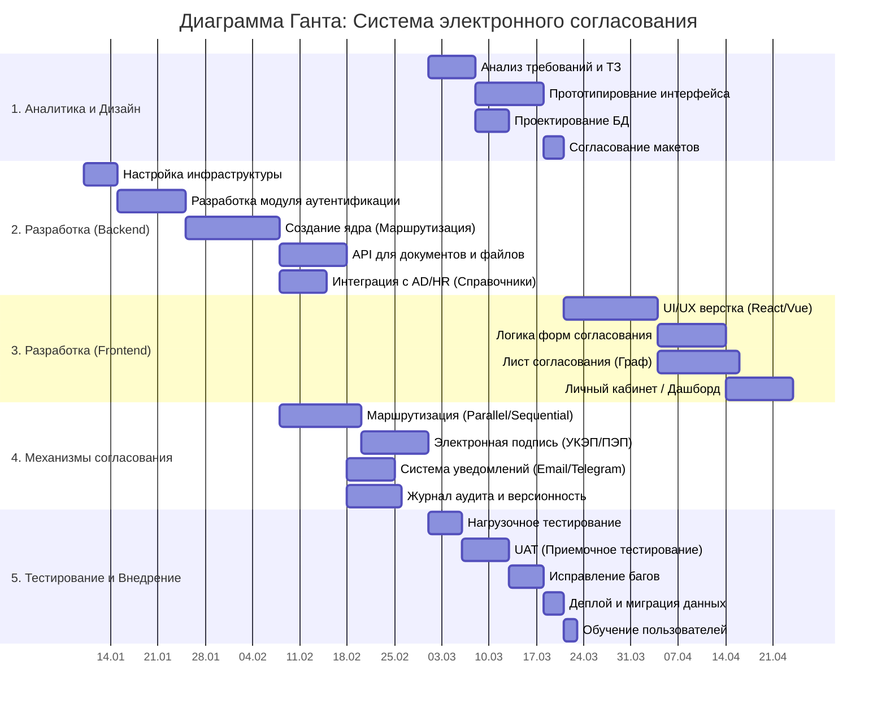

```mermaid
gantt
    title Диаграмма Ганта: Система электронного согласования
    dateFormat  YYYY-MM-DD
    axisFormat  %d.%m
    
    section 1. Аналитика и Дизайн
    Анализ требований и ТЗ        :a1, 2024-03-01, 7d
    Прототипирование интерфейса   :a2, after a1, 10d
    Проектирование БД             :a3, after a1, 5d
    Согласование макетов          :a4, after a2, 3d
    
    section 2. Разработка (Backend)
    Настройка инфраструктуры      :b1, 2024-01-10, 5d
    Разработка модуля аутентификации :b2, after b1, 10d
    Создание ядра (Маршрутизация) :b3, after b2, 14d
    API для документов и файлов   :b4, after b3, 10d
    Интеграция с AD/HR (Справочники) :b5, after b3, 7d
    
    section 3. Разработка (Frontend)
    UI/UX верстка (React/Vue)     :c1, after a4, 14d
    Логика форм согласования      :c2, after c1, 10d
    Лист согласования (Граф)      :c3, after c1, 12d
    Личный кабинет / Дашборд      :c4, after c2, 10d
    
    section 4. Механизмы согласования
    Маршрутизация (Parallel/Sequential) :d1, after b3, 12d
    Электронная подпись (УКЭП/ПЭП) :d2, after d1, 10d
    Система уведомлений (Email/Telegram) :d3, after b4, 7d
    Журнал аудита и версионность  :d4, after b4, 8d
    
    section 5. Тестирование и Внедрение
    Нагрузочное тестирование      :e1, after d2, 5d
    UAT (Приемочное тестирование) :e2, after e1, 7d
    Исправление багов             :e3, after e2, 5d
    Деплой и миграция данных      :e4, after e3, 3d
    Обучение пользователей        :e5, after e4, 2d
```
