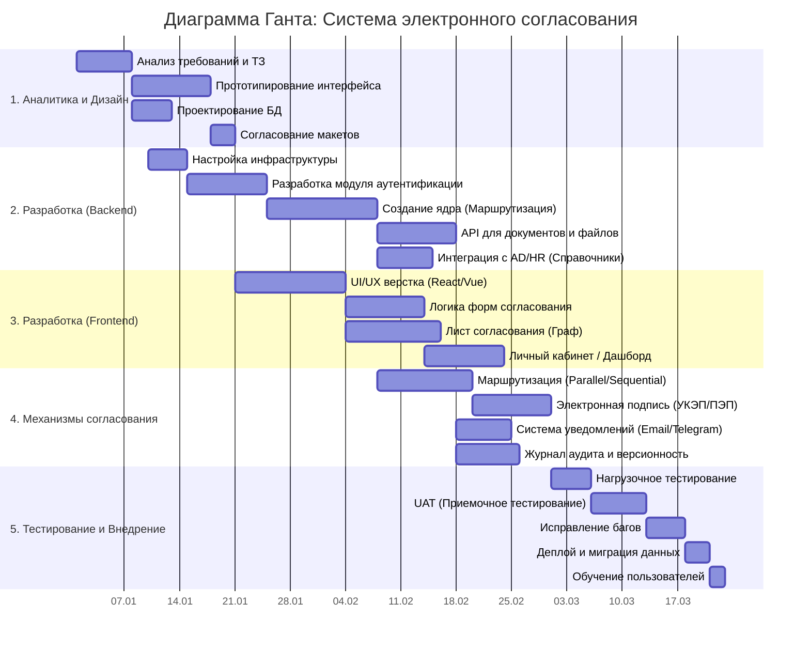

# Паспорт проекта
### Краткое описание
Система электронного согласования документов — это веб-приложение, которое позволяет сотрудникам компании создавать документы, отправлять их на согласование руководителям, подписывать электронной подписью и отслеживать статус в реальном времени.

Проект решает проблему бумажного документооборота: долгих хождений по кабинетам, потери листов и отсутствия контроля. Система автоматически строит маршруты согласования (последовательно или параллельно), отправляет уведомления и сохраняет полную историю действий.
### Цель проекта
Сократить время согласования документов с 3 дней до 4 часов и обеспечить полную прозрачность движения документов внутри компании за счет внедрения веб-системы с электронной подписью и автоматической маршрутизацией.
### Обоснование проекта
1) Потеря времени — согласование одного документа занимает от 3 до 7 дней из-за физических перемещений по кабинетам.
2) Потеря документов — до 15% бумаг теряются или залеживаются у согласующих.
3) Отсутствие контроля — невозможно понять, на каком этапе находится документ и кто задерживает согласование.
4) Высокие издержки — расходы на бумагу, печать, курьерскую доставку и архивное хранение.
5) Юридические риски — подлинность бумажной подписи сложно проверить, а электронная подпись законодательно признана (63-ФЗ).
6) Удаленная работа — офисные процессы не адаптированы для сотрудников, работающих из дома.
**Внедрение системы электронного согласования решает эти проблемы и окупается за 6-8 месяцев за счет сокращения простоев и оптимизации труда.**

### Исполнители проекта

| Роль | Количество | Зона ответственности |
| :--- | :---: | :--- |
| **Руководитель проекта (PM)** | 1 | Контроль сроков, бюджета, коммуникация с заказчиком |
| **Бизнес-аналитик** | 1 | Сбор требований, описание маршрутов, составление ТЗ |
| **Backend-разработчик** | 1 | Разработка API, БД, логики маршрутизации, интеграция с ЭЦП |
| **Frontend-разработчик** | 1 | Разработка интерфейса, личный кабинет, конструктор маршрутов |
| **Тестировщик (QA)** | 1 | Проверка функционала, поиск багов, нагрузочное тестирование |
| **Администратор БД (DBA)** | 1 | Проектирование БД, миграции, оптимизация запросов, бэкапы |
| **Системный администратор** | 1 | Настройка серверов, развертывание, SSL-сертификаты |
### Ограничения

# Диаграмма Ганта

# Смета
## Смета проекта

| № | Статья расходов | Кол-во | Цена за ед. (₽) | Итого (₽) |
| :--- | :--- | :---: | ---: | ---: |
| **1** | **Разработка** | | | |
| 1.1 | Аналитика и ТЗ | 22 дня | 2 500 | 55 000 |
| 1.2 | Backend-разработка | 31 день | 4 000 | 124 000 |
| 1.3 | Frontend-разработка | 28 дней | 4 000 | 112 000 |
| 1.4 | Интеграция ЭЦП (КриптоПРО) | 21 день | 4 000 | 84 000 |
| 1.5 | Тестирование (QA) | 20 дней | 3 000 | 60 000 |
| **2** | **Инфраструктура** | | | |
| 2.1 | Аренда сервера (VPS) | 4 мес | 5 000 | 20 000 |
| 2.2 | Облачное хранилище (бэкапы) | 4 мес | 2 000 | 8 000 |
| 2.3 | Домен и SSL-сертификат | 1 год | 2 500 | 2 500 |
| **3** | **Лицензии и ПО** | | | |
| 3.1 | КриптоПРО (серверная лицензия) | 1 шт | 75 000 | 75 000 |
| 3.2 | КриптоПРО (на 50 рабочих мест) | 50 шт | 1 500 | 75 000 |
| 3.3 | СУБД (PostgreSQL, если не бесплатно) | 1 шт | 0 | 0 |
| **4** | **Внедрение и сопровождение** | | | |
| 4.1 | Обучение пользователей (вебинар + инструкции) | 2 дня | 10 000 | 20 000 |
| 4.2 | Техническая поддержка (первые 3 мес) | 3 мес | 15 000 | 45 000 |
| | | | | |
| | **ИТОГО** | | | **680 500** |
| | **НДС 20%** | | | **136 100** |
| | **ВСЕГО с НДС** | | | **816 600** |

 # Матрица рисков
 ## Матрица рисков

| № | Риск | Вероятность (1-5) | Влияние (1-5) | Уровень риска | Меры предотвращения |
| :--- | :--- | :---: | :---: | :---: | :--- |
| 1 | Изменение требований к электронной подписи (63-ФЗ) | 3 | 5 | **Высокий** | Сделать модуль подписи заменяемым, изучить законодательство на старте |
| 2 | Срыв сроков из-за болезни ключевого разработчика | 3 | 4 | **Высокий** | Кросс-ревью кода, документация API, наставничество |
| 3 | Низкая производительность при 500+ пользователях | 2 | 5 | **Высокий** | Нагрузочное тестирование, кэширование, индексы в БД |
| 4 | Отказ заказчика от приемки из-за несоответствия ожиданиям | 3 | 4 | **Высокий** | Еженедельные демо, согласование макетов до разработки |
| 5 | Проблемы с интеграцией Active Directory (AD) | 3 | 3 | **Средний** | Выделить отдельный спринт на интеграцию, иметь fallback (ручной ввод сотрудников) |
| 6 | Утечка данных или взлом | 2 | 5 | **Высокий** | HTTPS, хэширование паролей, аудит доступа, регулярные бэкапы |
| 7 | Нехватка бюджета на лицензии КриптоПРО | 2 | 4 | **Средний** | Заложить бюджет заранее, рассмотреть альтернативы (КриптоАРМ) |
| 8 | Сложность освоения системы пользователями | 4 | 2 | **Средний** | Обучающие видео, инструкции, техподдержка первые 2 недели |
| 9 | Задержка поставки сервера/оборудования | 2 | 3 | **Низкий** | Использовать облачные решения (VPS) как резерв |
| 10 | Конфликт версий библиотек/зависимостей | 3 | 2 | **Средний** | Использовать Docker-контейнеризацию, фиксировать версии |

